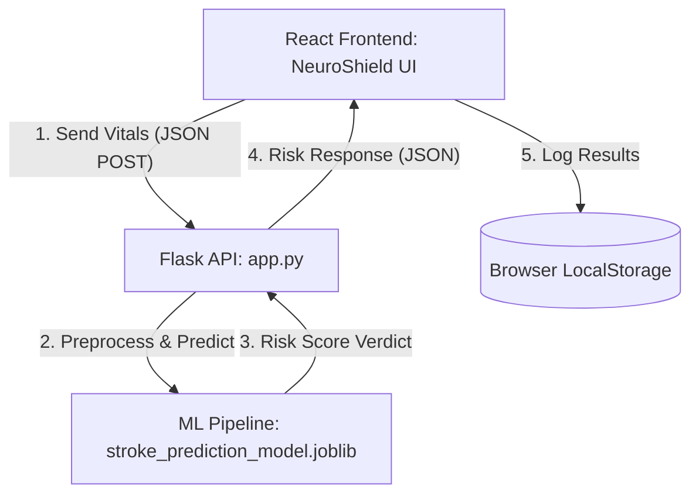

# 🧠 NeuroShield: Stroke Risk Assessment Engine

NeuroShield is an end-to-end, machine learning-powered web application designed to evaluate stroke risk based on client demographics, clinical vitals, and lifestyle factors. By leveraging a custom classification pipeline built in Python and an interactive, glassmorphic UI built in React, NeuroShield provides real-time, actionable health analytics.

---

## 🚀 Key Features

* **Multi-Step Diagnostic Assessment**: A structured, step-by-step form evaluating:
  * **Demographics**: Age, Gender, Marital Status
  * **Vitals**: BMI (Body Mass Index), Average Blood Glucose Level
  * **Medical & Lifestyle**: Hypertension, Heart Disease, Employment, Residence Type, and Smoking History
* **Real-time Health Classifications**: Instantly evaluates and flags BMI and Blood Glucose categories with visual feedback.
* **Clinical Decision Engine**: Predicts stroke likelihood using a pre-trained scikit-learn and imbalanced-learn machine learning pipeline.
* **Historical Audit Log**: Saves past assessments locally on the client device using `localStorage` for historical lookup.
* **F.A.S.T. Education Module**: Educates users on recognizing stroke warning signs quickly.

---

## 🏗️ System Architecture



---

## 📁 Repository Structure

```
Stroke Prediction/
├── backend/
│   ├── app.py                      # Flask API serving predictions on port 5000
│   ├── training.py                 # Pipeline evaluation, model training & export script
│   └── stroke_prediction_model.joblib # Saved pipeline binary (LDA + Preprocessors)
├── frontend/                       # React Web Application
│   ├── public/                     # Static assets and index.html
│   ├── src/                        # Component logic (App.js) and UI styling (App.css)
│   └── package.json                # React configuration & dependencies
├── stroke-data.csv                 # Raw clinical dataset utilized for training
└── README.md                       # Root documentation
```

---

## 🔬 Machine Learning Pipeline

The prediction model utilizes a high-performing classification pipeline designed to handle missing data and extreme class imbalance:

1. **Numerical Imputer**: `SimpleImputer` using the `median` strategy to handle any missing health vitals (e.g., BMI).
2. **Categorical Encoder**: `OneHotEncoder` to encode categorical inputs such as smoking status and work type.
3. **Power Transformer**: `PowerTransformer` (Yeo-Johnson) to stabilize variance and normalize distributions.
4. **SMOTE**: `Synthetic Minority Over-sampling Technique` to balance the stroke case ratio in the training data.
5. **Estimator**: `LinearDiscriminantAnalysis` (LDA), optimized and evaluated using a `RepeatedStratifiedKFold` cross-validation strategy.

---

## 🏁 Getting Started

To run the full stack locally, follow the steps below:

### 1. Prerequisites
Make sure you have [Node.js](https://nodejs.org/) (v16+) and [Python](https://www.python.org/) (v3.8+) installed.

---

### 2. Setting Up the Backend (Flask API)

1. Navigate to the backend directory:
   ```bash
   cd backend
   ```

2. Install the required packages:
   ```bash
   pip install flask flask-cors pandas joblib scikit-learn imbalanced-learn matplotlib
   ```

3. Run the Flask application:
   ```bash
   python app.py
   ```
   *The API will start running locally at `http://localhost:5000`.*

---

### 3. Setting Up the Frontend (React App)

1. Navigate to the frontend directory:
   ```bash
   cd ../frontend
   ```

2. Install project dependencies:
   ```bash
   npm install
   ```

3. Start the local development server:
   ```bash
   npm start
   ```
   *The interface will launch in your browser at `http://localhost:3000`.*

---

## 📉 Model Re-training

If you wish to update or re-train the underlying machine learning model using `stroke-data.csv`:

1. Ensure the raw dataset is present.
2. Run the training script:
   ```bash
   python backend/training.py
   ```
3. A cross-validation ROC-AUC performance boxplot will render, and the newly trained model pipeline will overwrite `backend/stroke_prediction_model.joblib`.

---

## ⚠️ Medical Disclaimer

NeuroShield is a diagnostic support simulation tool designed for educational and initial screening demonstration purposes. It does not replace professional medical advice, diagnosis, or treatment. Always consult with a qualified physician or healthcare provider for clinical assessments.
